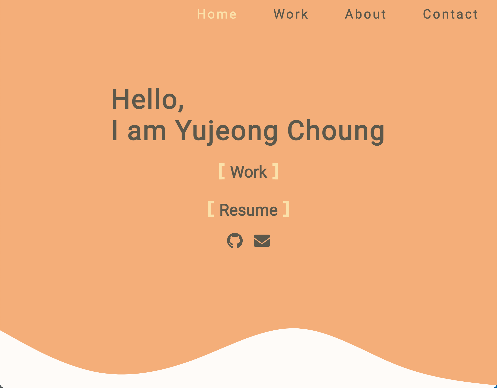

# Yujeong's Portfolio

Hi I am a junior Web Developer located in Vancouver Canada. This is my personal portfolio website built with Javascript and CSS only from **Design** to **Construction**.  
It showcases my personal works, school projects and contact information. It is also static and fully responsive.

> Live Demo : <a href='https://yujeong-portfolio.netlify.app/' > Click Here :)</a>

  

## Sections 📖

✔️ Home

- Resume

✔️ Work

- Personal projects
- School projects

✔️ About me

- Name
- Location
- A little bit about me

✔️ Contact me

 

## Technologies Used 🛠️

- HTML 
- CSS 
- Javascript 
